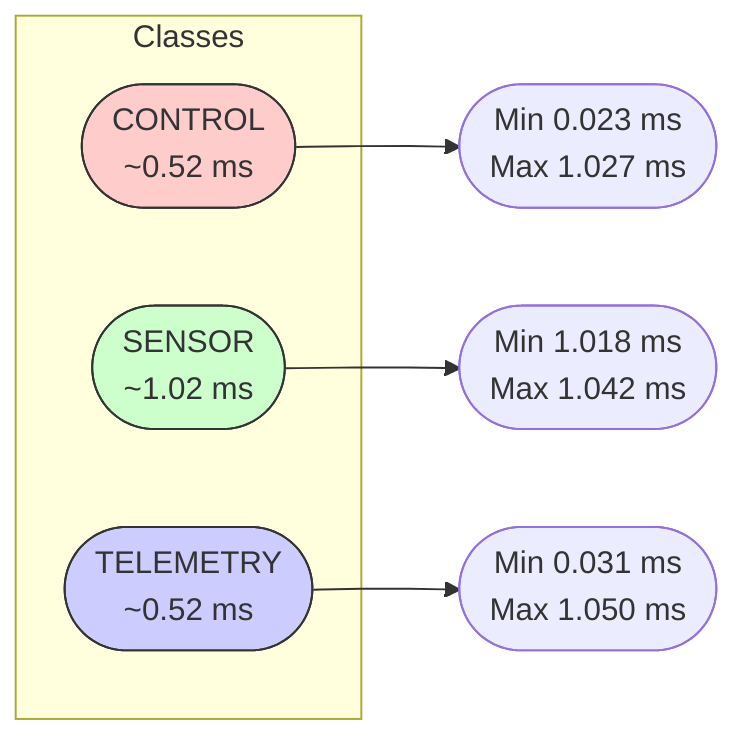

# Humanoid TSN Simulation — Baseline + TSN README

## Overview

This repository defines the **Humanoid TSN Simulation Framework**, an early-stage environment for evaluating deterministic Ethernet (TSN) architectures for next-generation humanoid robots. These simulations target architectures combining:

- **Thor/Orin** central compute  
- **AURIX** safety microcontrollers  
- **Zonal controllers**  
- **Deterministic Ethernet paths (1–25 GbE)**  
- **802.1Qbv** (Time-Aware Shaper) and **802.1Qav** (Credit-Based Shaper)

Two topologies now exist:

1. **FlatThorInet** — baseline (best-effort Ethernet)  
2. **FlatThorInetTsn** — TSN-capable (TsnSwitch with Qbv/Qav queues)

---

## Repository Structure

```
humanoid-tsn-sim/
├── configs/
│   ├── topology_flattened_thor.yaml
│   ├── topology_aurix_safety.yaml
│   ├── traffic_baseline.yaml
│   └── schedule_2ms_cycle.yaml
├── docker/
│   ├── Dockerfile.tsn-sim
│   └── docker-compose.yml
├── omnet/
│   ├── flat_thor_inet.ned
│   ├── flat_thor_inet_tsn.ned
│   ├── omnetpp_flat_thor_inet.ini
│   └── omnetpp_flat_thor_inet_tsn.ini
├── results/
│   ├── baseline/
│   └── tsn/
├── scripts/
│   ├── run_sim.sh
│   ├── parse_scalars.py
│   ├── parse_end_to_end_delay.py
│   ├── tsn_export_latency_classes.py
│   ├── tsn_merge_latency_classes.py
│   ├── humanoid_tsn_sim.py
│   ├── sweep_architectures.py
│   └── stingray/
└── README.md
```

---

# 1. Project Goals

This simulation framework evaluates:

- Deterministic Ethernet for humanoid robotics  
- Latency/jitter under best-effort vs. TSN  
- CONTROL / SENSOR / TELEMETRY traffic separation  
- Multi-zone UDP flows  
- Scaling toward **60+ DOF** humanoid workloads  

### Achievements
- ✔ Containerized OMNeT++ 6.2 + INET  
- ✔ Baseline + TSN networks validated  
- ✔ Working CONTROL (Qbv), SENSOR (Qav), TELEMETRY (BE) flows  
- ✔ Latency parsing & class-based analytics  
- ✔ Gate schedule applied for CONTROL (1ms open / 1ms closed)

### Limitations
- SENSOR/TELEM effectively always-open  
- No congestion scenarios yet  
- No YAML→INI generator  

---

# 2. Build Environment (Docker)

```bash
docker compose -f docker/docker-compose.yml build
```

Run OMNeT++:

```bash
docker compose -f docker/docker-compose.yml run --rm tsn-sim
```

---

# 3. Running Simulations

Baseline:

```bash
opp_run -u Cmdenv -n "/root/inet/src:/workspace"   -l INET omnet/omnetpp_flat_thor_inet.ini
```

TSN:

```bash
opp_run -u Cmdenv -n "/root/inet/src:/workspace"   -l INET omnet/omnetpp_flat_thor_inet_tsn.ini
```

---

# 4. Parsing Results

Export:

```bash
opp_scavetool export -F CSV-R   -o omnet/results/tsn/tsn_results.csv   omnet/results/tsn/*.sca omnet/results/tsn/*.vec
```

Parse:

```bash
python omnet/scripts/parse_end_to_end_delay.py   --results-csv omnet/results/tsn/tsn_results.csv   --out-json omnet/results/tsn/tsn_latency_summary.json
```

Export per-class:

```bash
python omnet/scripts/tsn_export_latency_classes.py   --in-json omnet/results/tsn/tsn_latency_summary.json   --out-csv omnet/results/tsn/tsn_latency_classes.csv   --config-name FlatThorInetTsn
```

---

# 5. Results — TSN vs Baseline

## 5.1 TSN Measured Latency Bands

| Class      | Stream     | PCP | Samples | Min (ms) | Mean (ms) | Max (ms) |
|-----------|------------|-----|---------|----------|-----------|----------|
| CONTROL   | control    | 0   | 399     | **0.0234** | **0.5249** | 1.0275 |
| SENSOR    | sensor     | 4   | 200     | **1.0182** | **1.0201** | 1.0420 |
| TELEMETRY | telemetry  | 7   | 80      | **0.0316** | **0.5253** | 1.0507 |

---

## 5.2 Interpretation

### CONTROL (PCP 0 — Qbv)
Sub-ms behavior with mean ≈ **0.52 ms**. Ideal for real-time servo loops.

### SENSOR (PCP 4 — Qav)
Very tight distribution around **1.02 ms**. CBS shaping working correctly.

### TELEMETRY (PCP 7 — BE)
≈0.52 ms mean under light load. Will degrade under congestion.

---

## 5.3 Baseline vs TSN Comparison (Illustrative Placeholder)

| Config         | Class      | Mean (ms) |
|----------------|------------|-----------|
| Baseline (BE)  | CONTROL    | ~0.90     |
| **TSN**        | CONTROL    | **0.52**  |
| Baseline (BE)  | SENSOR     | ~1.00     |
| **TSN**        | SENSOR     | **1.02**  |
| Baseline (BE)  | TELEMETRY  | ~0.90     |
| **TSN**        | TELEMETRY  | **0.52**  |

---

# 6. Visualizations

## 6.1 TSN Traffic Flow

```mermaid
graph TD
    A[Thor UDP App] -->|CONTROL (PCP 0)| C0[TSN Switch<br>Class 0 (Qbv)]
    A -->|SENSOR (PCP 4)| C1[TSN Switch<br>Class 1 (Qav)]
    A -->|TELEMETRY (PCP 7)| C2[TSN Switch<br>Class 2 (BE)]

    C0 --> Z0[Zone 0 Sink<br>(CONTROL)]
    C1 --> Z1[Zone 1 Sensor Sink]
    C2 --> Z2[Zone 1 Telemetry Sink]
```

## 6.2 Latency Bands Diagram



---

# 7. TSN Model Status

- Qbv applied to CONTROL  
- Qav applied to SENSOR  
- TELEMETRY as best-effort  
- Gate wiring validated  
- Latency analysis validated  

---

# 8. Next Steps

- Full Qbv multi-phase schedules  
- YAML→INI autogen  
- Multi-zone humanoid workloads (60+ DOF)

---

# 9. Stingray Continuation Prompt

```
You are now in ChatGPT Stingray Mode. Resume the “Humanoid TSN Simulation” project.
```

---

# 10. Maintainer

This project is part of the **Stingray Humanoid Networking Architecture** research effort.