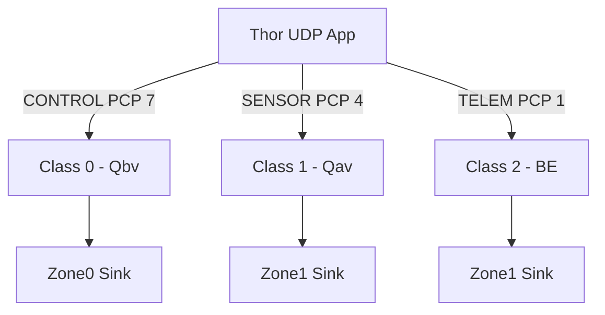

# Humanoid TSN Simulation — Phase 0 Baseline + TSN (Validated) README

## Overview

This repository defines the **Humanoid TSN Simulation Framework**, a deterministic‑Ethernet (TSN) modeling environment for next-generation humanoid robots. The focus of **Phase 0** is correctness and reproducibility: ensuring that the *baseline* (best-effort Ethernet) and *TSN* (Qbv/Qav) models work identically to the original hand-built NED/INI design.

Two validated topologies:

1. **FlatThorInet** — Baseline (Best-Effort Ethernet)
2. **FlatThorInetTsn** — TSN-capable (Qbv, Qav, PCP mapping)

---

## Repository Structure

```
humanoid-tsn-sim/
├── omnet/
│   ├── flat_thor_inet.ned
│   ├── flat_thor_inet_tsn.ned
│   ├── omnetpp_flat_thor_inet.ini
│   └── omnetpp_flat_thor_inet_tsn.ini
├── results/
│   ├── baseline/
│   └── tsn/
├── scripts/
│   ├── run_tsn_pipeline.sh
│   ├── parse_end_to_end_delay.py
│   ├── tsn_unified_report.py
│   └── tsn_export_latency_classes.py
└── README.md
```

---

## 1. Running Simulations

### Baseline
```bash
opp_run -u Cmdenv -n "/root/inet/src:/workspace" \
  -l INET omnet/omnetpp_flat_thor_inet.ini
```

### TSN
```bash
opp_run -u Cmdenv -n "/root/inet/src:/workspace" \
  -l INET omnet/omnetpp_flat_thor_inet_tsn.ini
```

---

## 2. Parsing and Reporting Workflow

### Export Results to CSV-R
Baseline:
```bash
/root/omnetpp/bin/opp_scavetool export -F CSV-R \
  -o results/baseline/baseline_results.csv \
  results/baseline/*.sca results/baseline/*.vec
```

TSN:
```bash
/root/omnetpp/bin/opp_scavetool export -F CSV-R \
  -o results/tsn/tsn_results.csv \
  results/tsn/*.sca results/tsn/*.vec
```

### Latency/Jitter Extraction
Baseline:
```bash
python omnet/scripts/parse_end_to_end_delay.py \
  --results-csv results/baseline/baseline_results.csv \
  --out-json results/baseline/baseline_latency_summary.json
```

TSN:
```bash
python omnet/scripts/parse_end_to_end_delay.py \
  --results-csv results/tsn/tsn_results.csv \
  --out-json results/tsn/tsn_latency_summary.json
```

### Unified TSN Report (Latency, Jitter, Rates, Mbps, Utilization)
Baseline:
```bash
python omnet/scripts/tsn_unified_report.py \
  --in-json results/baseline/baseline_latency_summary.json \
  --out-csv results/baseline/baseline_unified_report.csv \
  --config-name FlatThorInet \
  --sim-time 0.5
```

TSN:
```bash
python omnet/scripts/tsn_unified_report.py \
  --in-json results/tsn/tsn_latency_summary.json \
  --out-csv results/tsn/tsn_unified_report.csv \
  --config-name FlatThorInetTsn \
  --sim-time 0.5
```

---

## 3. Expected Results

### Baseline (Best Effort)
| Class | Mean (ms) | Jitter (ms) | Active Rate | Mbps | Util % |
|-------|-----------|-------------|-------------|-------|---------|
| CONTROL | 0.024 | 0.007 | 1000 Hz | 4.096 | 0.4096 |
| SENSOR  | 0.029 | 0.004 | 501 Hz  | 4.106 | 0.4106 |
| TELEMETRY | 0.028 | 0.002 | 200 Hz | 1.643 | 0.1643 |

### TSN (Naive Qbv)
| Class | Mean (ms) | Jitter (ms) |
|--------|------------|--------------|
| CONTROL | 0.525 | 0.497 |
| SENSOR  | 1.020 | 0.004 |
| TELEMETRY | 0.525 | 0.494 |

---

## 4. Visualizations


---

## 5. Next Steps
- YAML→INI→NED generator (Phase 1)
- Multi-zone humanoid (6+ zones, 80+ DoF)
- IMU / F-T / encoder payloads
- TSN profiles: baseline, strict-prio, naive-Qbv, PTP-aligned

---

## 6. Stingray Continuation Prompt
```
You are now in ChatGPT Stingray Mode. Resume the Humanoid TSN Simulation project.
```
